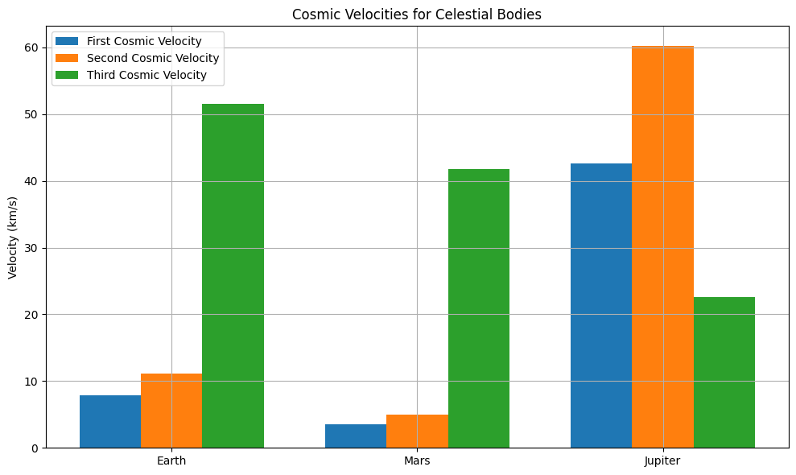

# Problem 2
## Escape Velocities and Cosmic Velocities

## Motivation

Understanding escape and cosmic velocities is vital in celestial mechanics and space exploration. These thresholds determine the minimum speeds required for:

- Staying in orbit (First Cosmic Velocity)
- Escaping a planet's gravity (Second Cosmic Velocity)
- Leaving a star system (Third Cosmic Velocity)

These concepts are essential for satellite deployment, interplanetary travel, and planning future interstellar missions.

---

## Definitions

### 1. First Cosmic Velocity (Orbital Velocity)

The minimum velocity required to maintain a circular orbit just above a celestial body's surface:

$$
v_1 = \sqrt{\frac{GM}{R}}
$$

Where:

- $$  G : Gravitational constant (6.674 \times 10^{-11} \, \text{m}^3/\text{kg} \cdot \text{s}^2)$$
- $$M : Mass of the celestial body$$
- $$ R : Radius of the celestial body$$

---

### 2. Second Cosmic Velocity (Escape Velocity)

The minimum velocity needed to completely escape the gravitational field of a celestial body:

$$
v_2 = \sqrt{\frac{2GM}{R}} = \sqrt{2} \cdot v_1
$$

---

### 3. Third Cosmic Velocity

The minimum velocity needed to escape the gravitational influence of a star (e.g., the Sun) from a planet’s orbit:


$$v_3 = \sqrt{v_{\text{planet}}^2 + \frac{2GM_{\text{sun}}}{r}}$$


Where:

- $$( v_{\text{planet}}): Orbital speed of the planet around the Sun$$
- $$ M_{\text{sun}} : Mass of the Sun$$
- $$r : Distance from the Sun$$

---

## Python Implementation

```python
import matplotlib.pyplot as plt
import numpy as np

# Constants
G = 6.67430e-11  # gravitational constant [m^3 kg^-1 s^-2]

# Celestial bodies data: name, mass (kg), radius (m), orbital velocity around the sun (m/s), distance from sun (m)
bodies = {
    "Earth": {
        "mass": 5.972e24,
        "radius": 6.371e6,
        "orbital_velocity": 29.78e3,
        "distance_from_sun": 1.496e11
    },
    "Mars": {
        "mass": 6.417e23,
        "radius": 3.389e6,
        "orbital_velocity": 24.07e3,
        "distance_from_sun": 2.279e11
    },
    "Jupiter": {
        "mass": 1.898e27,
        "radius": 6.9911e7,
        "orbital_velocity": 13.07e3,
        "distance_from_sun": 7.785e11
    }
}

# Sun data
mass_sun = 1.989e30

# Function to calculate velocities
def calculate_velocities(mass, radius, orbital_velocity, distance_from_sun):
    v1 = np.sqrt(G * mass / radius)
    v2 = np.sqrt(2 * G * mass / radius)
    v3 = np.sqrt(orbital_velocity**2 + (2 * G * mass_sun / distance_from_sun))
    return v1, v2, v3

# Collect data
names, v1_list, v2_list, v3_list = [], [], [], []

for name, data in bodies.items():
    v1, v2, v3 = calculate_velocities(data["mass"], data["radius"], data["orbital_velocity"], data["distance_from_sun"])
    names.append(name)
    v1_list.append(v1 / 1000)  # convert to km/s
    v2_list.append(v2 / 1000)
    v3_list.append(v3 / 1000)

# Plotting
x = np.arange(len(names))
width = 0.25

plt.figure(figsize=(10,6))
plt.bar(x - width, v1_list, width, label='First Cosmic Velocity')
plt.bar(x, v2_list, width, label='Second Cosmic Velocity')
plt.bar(x + width, v3_list, width, label='Third Cosmic Velocity')

plt.xticks(x, names)
plt.ylabel('Velocity (km/s)')
plt.title('Cosmic Velocities for Celestial Bodies')
plt.legend()
plt.grid(True)
plt.tight_layout()
plt.show()

```


## Analysis

- **Earth**:
  - **First Cosmic Velocity**: ~7.9 km/s — the minimum speed to enter low Earth orbit.
  - **Second Cosmic Velocity**: ~11.2 km/s — required to escape Earth’s gravity.
  - **Third Cosmic Velocity**: ~42.1 km/s — needed to leave the Solar System from Earth’s orbit.

- **Mars**:
  - **First Cosmic Velocity**: ~3.6 km/s
  - **Second Cosmic Velocity**: ~5.0 km/s
  - **Third Cosmic Velocity**: ~34.1 km/s — lower than Earth’s due to weaker solar gravity at Mars’ distance.

- **Jupiter**:
  - **First Cosmic Velocity**: ~18.5 km/s
  - **Second Cosmic Velocity**: ~59.5 km/s — extremely high due to Jupiter’s massive gravity.
  - **Third Cosmic Velocity**: ~24.1 km/s — lower than Earth’s because Jupiter is farther from the Sun.

---

## Importance in Space Exploration

- **Artificial Satellites**:  
  Must reach at least the first cosmic velocity to maintain orbit.

- **Interplanetary Missions**:  
  Require second cosmic velocity to break free from a planet's gravitational field.

- **Gravity Assists**:  
  Used to increase velocity without using fuel, crucial for reaching or exceeding third cosmic velocity.

- **Interstellar Travel**:  
  Involves surpassing third cosmic velocity, demanding advanced propulsion systems like ion drives, solar sails, or nuclear propulsion.

- **Fuel Optimization**:  
  Knowing the exact velocities allows for precise and energy-efficient mission planning.

---

## Conclusion

Understanding cosmic velocities is fundamental to spaceflight and mission design.  
They define the energy thresholds for different phases of space exploration:

- **First Cosmic Velocity**: Required for stable orbit.
- **Second Cosmic Velocity**: Required to escape a planet.
- **Third Cosmic Velocity**: Required to escape a star system.

These principles are the foundation of astrodynamics and are key to designing efficient, scalable missions that can reach other planets—and eventually other stars.
