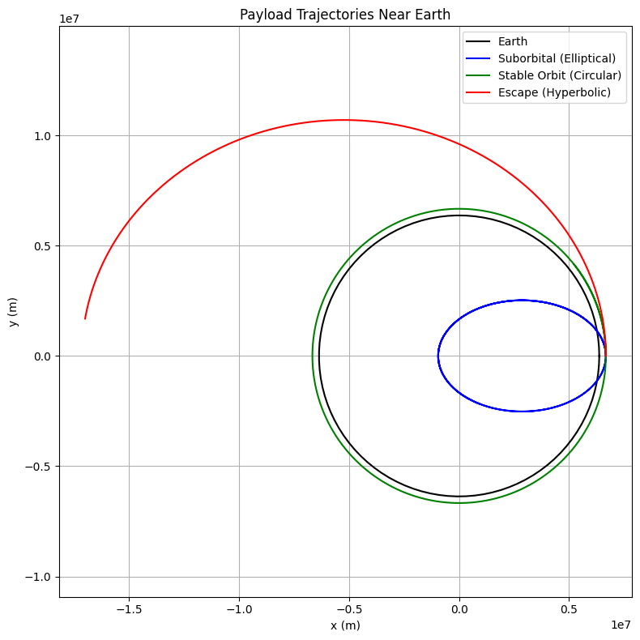

# Problem 3

# 🌍 Trajectories of a Freely Released Payload Near Earth

## 📌 Motivation

When a payload is released from a spacecraft, its trajectory can vary greatly depending on its initial velocity and position. Whether it falls back to Earth, enters orbit, or escapes into space depends on classical orbital mechanics and Newtonian gravity. This simulation explores different outcomes of payload releases near Earth.

---

## 🎯 Objectives

- Analyze trajectory types: **elliptical**, **parabolic**, **hyperbolic**
- Simulate and visualize the payload’s motion under Earth’s gravity
- Understand relationships to real-world missions: **orbital insertion**, **reentry**, or **escape**

---

## 🌌 Theoretical Background

### Newton’s Law of Gravitation

\[
F = \frac{GMm}{r^2}
\]

### Newton's Second Law

\[
\vec{a} = \frac{F}{m} = -\frac{GM}{r^2} \hat{r}
\]

### Equations of Motion in 2D

\[
\frac{d^2x}{dt^2} = -\frac{GMx}{(x^2 + y^2)^{3/2}}, \quad \frac{d^2y}{dt^2} = -\frac{GMy}{(x^2 + y^2)^{3/2}}
\]

These equations are integrated numerically using the **Runge-Kutta** method.

---

## 🌍 Earth Constants

- \( G = 6.67430 \times 10^{-11} \, \text{Nm}^2/\text{kg}^2 \)
- \( M = 5.972 \times 10^{24} \, \text{kg} \)
- \( R = 6.371 \times 10^6 \, \text{m} \) (Earth radius)

---

## 🐍 Python Code

```python
import numpy as np
import matplotlib.pyplot as plt
from scipy.integrate import solve_ivp

# Constants
G = 6.67430e-11        # Gravitational constant
M = 5.972e24           # Earth mass
R_earth = 6.371e6      # Earth radius

# Gravity function
def gravity(t, y):
    x, vx, y_, vy = y
    r = np.sqrt(x**2 + y_**2)
    ax = -G * M * x / r**3
    ay = -G * M * y_ / r**3
    return [vx, ax, vy, ay]

# Initial conditions
altitude = 300e3               # 300 km above surface
r0 = R_earth + altitude
v_circular = np.sqrt(G * M / r0)

# Try different initial velocities
v_multipliers = [0.5, 1.0, 1.2]
colors = ['blue', 'green', 'red']
labels = ['Suborbital (Elliptical)', 'Stable Orbit (Circular)', 'Escape (Hyperbolic)']

# Time span and evaluation points
t_span = (0, 6000)
t_eval = np.linspace(*t_span, 5000)

# Plot Earth
theta = np.linspace(0, 2*np.pi, 100)
earth_x = R_earth * np.cos(theta)
earth_y = R_earth * np.sin(theta)

plt.figure(figsize=(8, 8))
plt.plot(earth_x, earth_y, 'k', label='Earth')

# Simulate trajectories
for i, mult in enumerate(v_multipliers):
    vx0 = 0
    vy0 = mult * v_circular
    y0 = [r0, vx0, 0, vy0]
    sol = solve_ivp(gravity, t_span, y0, t_eval=t_eval, rtol=1e-8)
    
    plt.plot(sol.y[0], sol.y[2], color=colors[i], label=labels[i])

plt.xlabel('x (m)')
plt.ylabel('y (m)')
plt.title('Payload Trajectories Near Earth')
plt.axis('equal')
plt.grid(True)
plt.legend()
plt.tight_layout()
plt.show()

```

