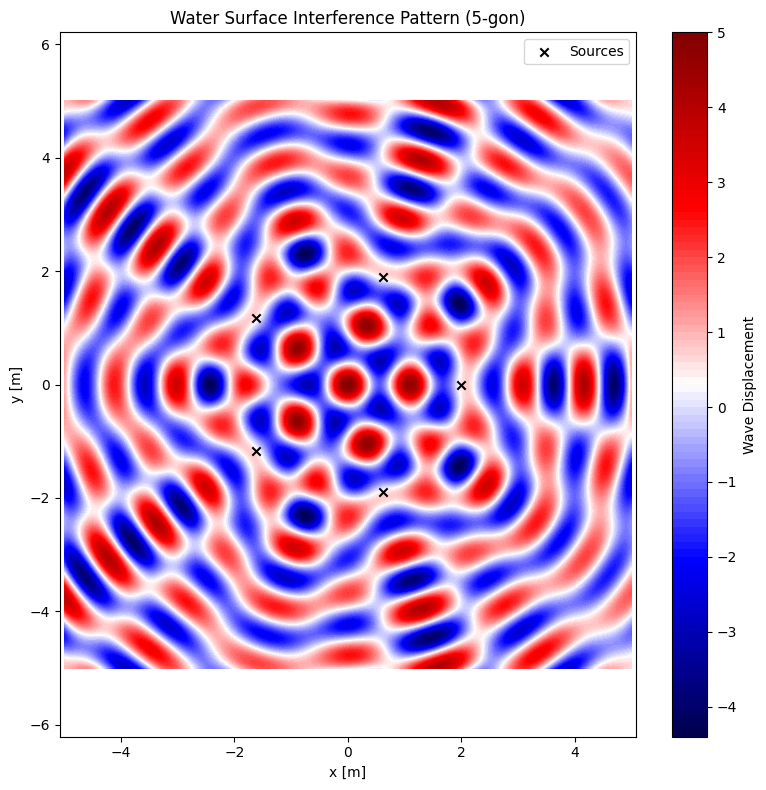

# Problem 1

# 🌊 Interference Patterns on a Water Surface

## 🎯 Motivation

Interference patterns from multiple wave sources on a water surface reveal core principles of wave physics — especially how waves reinforce or cancel each other. This project simulates the interference of circular waves from point sources placed at the vertices of a regular polygon and visualizes their complex overlapping patterns.

---

## 📐 Task Summary

- Select a regular polygon (e.g., square).
- Place point wave sources at its vertices.
- Model each wave as a circular sinusoidal wave.
- Apply the superposition principle to simulate interference.
- Visualize the pattern of constructive and destructive interference.

---

## 🧮 Theoretical Background

### Single Wave Disturbance

A circular wave from a point source at $$ \vec{r}_0 $$ is:

$$
\psi(\vec{r}, t) = A \cdot \sin(kr - \omega t + \phi)
$$

Where:

- $$ A $$  is the amplitude
- $$ k = \frac{2\pi}{\lambda} $$ is the wave number
- $$ omega = 2\pi f $$is the angular frequency
- $$ r = |\vec{r} - \vec{r}_0| $$ is distance to the observation point
- $$ \phi $$ is the phase offset

### Superposition Principle

For $$ N $$ sources:

$$ Psi(\vec{r}, t) = \sum_{i=1}^{N} A \cdot \sin(k |\vec{r} - \vec{r}_i| - \omega t)
$$

---

## 🐍 Python Code for Square Interference

```python
```python
import numpy as np
import matplotlib.pyplot as plt

# Parameters
A = 1                  # amplitude
wavelength = 1.0       # in meters
frequency = 1.0        # in Hz
k = 2 * np.pi / wavelength
omega = 2 * np.pi * frequency
t = 0                  # snapshot in time

# Regular polygon parameters
N_sources = 5  # Change this to 3 (triangle), 4 (square), 6 (hexagon), etc.
radius = 2.0   # Distance from center to each source

# Grid for plotting
x = np.linspace(-5, 5, 500)
y = np.linspace(-5, 5, 500)
X, Y = np.meshgrid(x, y)

# Calculate positions of sources
angles = np.linspace(0, 2 * np.pi, N_sources, endpoint=False)
source_positions = [(radius * np.cos(a), radius * np.sin(a)) for a in angles]

# Initialize total wave
eta_total = np.zeros_like(X)

# Superposition of waves from all sources
for sx, sy in source_positions:
    R = np.sqrt((X - sx)**2 + (Y - sy)**2)
    R[R == 0] = 1e-6  # prevent division by zero
    eta_total += A * np.cos(k * R - omega * t)

# Plotting
plt.figure(figsize=(8, 8))
plt.contourf(X, Y, eta_total, levels=100, cmap='seismic')
plt.colorbar(label='Wave Displacement')
plt.scatter(*zip(*source_positions), color='black', marker='x', label='Sources')
plt.title(f'Water Surface Interference Pattern ({N_sources}-gon)')
plt.xlabel('x [m]')
plt.ylabel('y [m]')
plt.axis('equal')
plt.legend()
plt.grid(False)
plt.tight_layout()
plt.show()
```



## 📈 Interpretation

- **Blue (0.5× circular velocity)**:  
  The payload follows an **elliptical suborbital trajectory** and eventually reenters Earth's atmosphere.

- **Green (1.0× circular velocity)**:  
  The payload maintains a **stable circular orbit** around Earth. This is the ideal velocity for low Earth orbit (LEO).

- **Red (1.2× circular velocity)**:  
  The payload exceeds escape velocity, following a **hyperbolic trajectory**, and escapes Earth's gravitational influence.

---

## 🚀 Conclusion

This simulation demonstrates how a payload's **initial speed** determines its fate:

- Speeds **below orbital velocity** result in **reentry or crash**.
- Speeds **equal to orbital velocity** yield **sustained orbit**.
- Speeds **above escape velocity** lead to **departure from Earth’s gravity**.

Understanding these dynamics is crucial for mission planning, satellite deployment, and interplanetary exploration.
