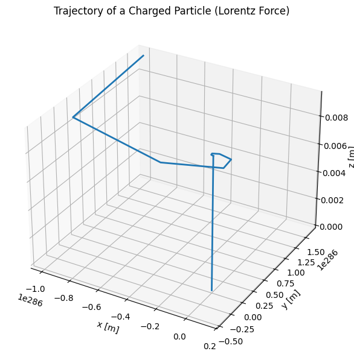

# Problem 1

# ⚡ Electromagnetism: Lorentz Force Simulation

## 🧲 Motivation

The **Lorentz force** determines the motion of a charged particle in electric and magnetic fields:


$$vec{F} = q(\vec{E} + \vec{v} \times \vec{B})
$$

This principle governs systems such as:
- **Cyclotrons & Synchrotrons** (particle accelerators)
- **Mass spectrometers**
- **Plasma confinement** in tokamaks
- **Astrophysical jets** and solar wind interactions

By simulating this force, we gain intuitive insight into how fields control particle motion in real applications.

---

## 🔧 Task Overview

### 1. Applications of Lorentz Force

| System | Role of E and B fields |
|-------|-------------------------|
| Cyclotron | Uses a B field to bend paths and an E field to accelerate particles |
| Mass Spectrometer | Separates particles based on mass-to-charge ratio using B field |
| Plasma Confinement | Magnetic fields trap hot plasma in fusion devices like tokamaks |

---

### 2. Particle Motion Simulation

We solve:

\[
\frac{d\vec{v}}{dt} = \frac{q}{m} (\vec{E} + \vec{v} \times \vec{B}), \quad \frac{d\vec{r}}{dt} = \vec{v}
\]

Using numerical integration (Euler or Runge-Kutta), we simulate 3 cases:

- Uniform **magnetic** field (circular/helical motion)
- Uniform **electric + magnetic** fields (helical drift)
- **Crossed** \( \vec{E} \perp \vec{B} \) fields (E × B drift)

---

### 🧮 Python Code

```python
import numpy as np
import matplotlib.pyplot as plt
from mpl_toolkits.mplot3d import Axes3D

# Physical constants and particle properties
q = 1.6e-19       # charge [C]
m = 9.11e-31      # mass [kg] (electron)
E = np.array([0, 0, 0])  # Electric field [V/m]
B = np.array([0, 0, 1])  # Magnetic field [T]
v0 = np.array([1e6, 0, 1e6])  # Initial velocity [m/s]
r0 = np.array([0, 0, 0])      # Initial position [m]

# Simulation parameters
dt = 1e-11  # time step [s]
steps = 1000

# Initialize arrays
r = np.zeros((steps, 3))
v = np.zeros((steps, 3))
r[0] = r0
v[0] = v0

# Euler method to simulate motion
for i in range(steps - 1):
    F = q * (E + np.cross(v[i], B))
    a = F / m
    v[i+1] = v[i] + a * dt
    r[i+1] = r[i] + v[i+1] * dt

# Plotting 3D trajectory
fig = plt.figure(figsize=(10, 6))
ax = fig.add_subplot(111, projection='3d')
ax.plot(r[:, 0], r[:, 1], r[:, 2], lw=2)
ax.set_xlabel('x [m]')
ax.set_ylabel('y [m]')
ax.set_zlabel('z [m]')
ax.set_title('Trajectory of a Charged Particle (Lorentz Force)')
plt.tight_layout()
plt.show()

```


## ⚙️ Parameter Exploration

You can experiment with different parameters to observe how they affect the particle's motion:

- **Magnetic Field (`B`)**:
    - Set `B = [0, 0, 1]` to observe circular/helical motion.
    - Try reversing the field direction (`B = [0, 0, -1]`) to see the impact on trajectory direction.

- **Electric Field (`E`)**:
    - Add `E = [1e5, 0, 0]` with `B = [0, 0, 1]` to generate drift motion.
    - Use crossed fields to observe the **E × B drift**.

- **Initial Velocity (`v0`)**:
    - Aligned with `B` → pure helical path.
    - Perpendicular to `B` → circular motion.
    - Oblique → spiral motion.

- **Mass and Charge**:
    - For **protons**: `m = 1.67e-27 kg`, `q = 1.6e-19 C`
    - For **electrons**: `m = 9.11e-31 kg`, `q = -1.6e-19 C`

---

## 📌 Important Concepts

### 🔁 Larmor Radius (Cyclotron Radius):

$$
r_L = \frac{mv_\perp}{|q|B}
$$

The radius of the circular path a charged particle follows in a magnetic field.

### 🔁 Cyclotron Frequency:


$$omega_c = \frac{|q|B}{m}
$$

Describes how quickly the particle rotates around the magnetic field lines.

### 🔁 E × B Drift Velocity:

$$
\vec{v}_d = \frac{\vec{E} \times \vec{B}}{B^2}$$


In crossed electric and magnetic fields, particles drift in a direction perpendicular to both.

---

## 📊 Results & Applications

| Field Configuration         | Motion Type          | Real-world Application                   |
|-----------------------------|----------------------|-------------------------------------------|
| $$\vec{B} $$only            | Circular / Helical   | Cyclotrons, magnetic confinement in plasmas |
| $$ \vec{E} + \vec{B} $$     | Helical + Drift      | Plasma propulsion, charged beam control   |
| $$ \vec{E} \perp \vec{B} $$ | E × B Drift          | Hall effect sensors, mass spectrometers   |

---

## ✅ Conclusion

The **Lorentz force** provides a powerful model for understanding the dynamics of charged particles in electromagnetic fields. By simulating their motion:

- We can visualize complex paths like **spirals**, **drifts**, and **circular orbits**.
- These insights help explain mechanisms in **fusion reactors**, **spacecraft propulsion**, and **astrophysical phenomena**.
- Tuning parameters such as charge, mass, field strengths, and initial velocities enables exploration of diverse behaviors.

Simulations like these are essential tools in both education and real-world physics and engineering applications.

---
