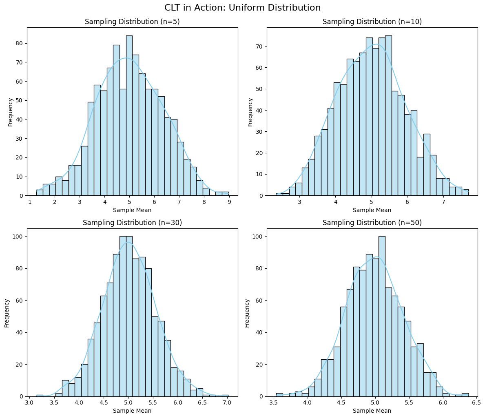

# Problem 1

# 📊 Exploring the Central Limit Theorem through Simulations

## 🎯 Motivation

The **Central Limit Theorem (CLT)** is a cornerstone of probability and statistics. It states that the **sampling distribution of the sample mean** approaches a **normal distribution** as the sample size increases, regardless of the population’s original distribution.

This powerful concept explains why the normal distribution appears so frequently in practice. Simulations provide an intuitive and hands-on way to observe this phenomenon.

---

## ✅ Task Overview

### 1. Simulating Sampling Distributions

Select several types of **population distributions**, such as:

- Uniform distribution
- Exponential distribution
- Binomial distribution

For each distribution, generate a **large population dataset** (e.g., size = 100,000).

---

### 2. Sampling and Visualization

For each population:

- Randomly draw **samples of different sizes**: \( n = 5, 10, 30, 50 \)
- Compute the **sample mean** for each sample
- Repeat this process **many times** (e.g., 1000 repetitions)
- **Plot histograms** of the sample means to form **sampling distributions**

Observe how the distributions of the sample means **converge to normal** as \( n \) increases.

---

### 3. Parameter Exploration

- Investigate how the **shape** of the original population affects the **rate of convergence**
- Explore how the **variance of the population** influences the **spread** of the sampling distribution
- Compare different distributions side-by-side for better insights

---

### 4. Practical Applications of CLT

Discuss the importance of CLT in real-world contexts:

- 📐 Estimating unknown population parameters (e.g., means in surveys)
- 🏭 Quality control and manufacturing
- 📈 Predictive modeling in finance and economics

---

## 🐍 Python Code 
```python
import numpy as np
import matplotlib.pyplot as plt
import seaborn as sns

# Set seed for reproducibility
np.random.seed(42)

# Generate a uniform population
population = np.random.uniform(0, 10, size=100_000)

# Sampling settings
sample_sizes = [5, 10, 30, 50]
num_samples = 1000

# Plot
plt.figure(figsize=(12, 10))

for i, n in enumerate(sample_sizes):
    sample_means = [np.mean(np.random.choice(population, size=n, replace=False)) for _ in range(num_samples)]
    
    plt.subplot(2, 2, i+1)
    sns.histplot(sample_means, bins=30, kde=True, color='skyblue')
    plt.title(f'Sampling Distribution (n={n})')
    plt.xlabel('Sample Mean')
    plt.ylabel('Frequency')

plt.tight_layout()
plt.suptitle('CLT in Action: Uniform Distribution', fontsize=16, y=1.02)
plt.show()
 
```
