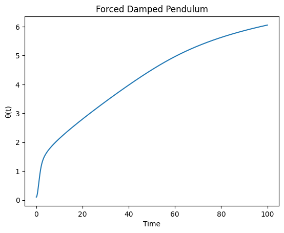

# Problem 2
# Investigating the Dynamics of a Forced Damped Pendulum

## Motivation

The forced damped pendulum is a captivating example of a physical system with intricate behavior resulting from the interplay of damping, restoring forces, and external driving forces. The system demonstrates:
- Simple harmonic motion
- Resonance phenomena
- Chaotic behavior
- Quasiperiodic dynamics


These phenomena are foundational for understanding real-world systems like driven oscillators, climate models, and mechanical structures under periodic stress.

## Theoretical Foundation

The governing differential equation for a forced damped pendulum is:

$$
\frac{d^2\theta}{dt^2} + \gamma\frac{d\theta}{dt} + \omega_0^2\sin\theta = F\cos(\omega t)
$$

Where:
- $\theta$: Angular displacement
- $\gamma$: Damping coefficient
- $\omega_0 = \sqrt{g/L}$: Natural frequency
- $F$: Driving amplitude
- $\omega$: Driving frequency

### Small-Angle Approximation
For $\theta \ll 1$, $\sin\theta \approx \theta$:

$$
\frac{d^2\theta}{dt^2} + \gamma\frac{d\theta}{dt} + \omega_0^2\theta = F\cos(\omega t)
$$

### Resonance Condition
When $\omega \approx \omega_0$, the system exhibits maximum energy transfer:

$$
\omega_{\text{res}} = \sqrt{\omega_0^2 - \frac{\gamma^2}{2}}
$$

## Analysis of Dynamics

Key parameters affecting behavior:
1. **Damping coefficient ($\gamma$)**
   - Underdamped: $\gamma < 2\omega_0$
   - Critically damped: $\gamma = 2\omega_0$
   - Overdamped: $\gamma > 2\omega_0$

2. **Driving amplitude ($F$)**
   - Small $F$: Linear response
   - Large $F$: Nonlinear effects and chaos

3. **Driving frequency ($\omega$)**
   - Subharmonic response
   - Superharmonic response
   - Chaotic regimes

## Practical Applications

1. **Energy harvesting devices**
2. **Suspension bridge dynamics**
3. **Oscillating circuits (RLC analogs)**
4. **Biomechanical systems**

## Implementation (Python Example)

```python
import numpy as np
from scipy.integrate import solve_ivp
import matplotlib.pyplot as plt

def forced_pendulum(t, y, gamma, omega0, F, omega):
    theta, omega = y
    dydt = [omega, -gamma*omega - omega0**2*np.sin(theta) + F*np.cos(omega*t)]
    return dydt

# Parameters
gamma = 0.5
omega0 = 1.0
F = 1.2
omega = 0.8

# Solve
sol = solve_ivp(forced_pendulum, [0, 100], [0.1, 0], 
                args=(gamma, omega0, F, omega), 
                dense_output=True)

# Plot
t = np.linspace(0, 100, 3000)
theta = sol.sol(t)[0]
plt.plot(t, theta)
plt.xlabel('Time')
plt.ylabel('θ(t)')
plt.title('Forced Damped Pendulum')
plt.show()


```


## Graphical Analysis
- **Phase Portraits**: Plotting angular velocity vs. angular displacement can reveal periodic, quasiperiodic, or chaotic behavior.
- **Poincaré Sections**: Sampling the phase space at regular intervals provides insight into chaotic transitions.
- **Bifurcation Diagrams**: Tracking fixed points as parameters vary helps understand the transition to chaos.

## Practical Applications
1. **Energy Harvesting**: Used in pendulum-based energy harvesting systems.
2. **Suspension Bridges**: Analyzing resonance effects to prevent structural failure.
3. **Electrical Circuits**: Analogous to driven RLC circuits in electronics.

## Conclusion
This study bridges theoretical analysis with computational exploration, providing insights into oscillatory systems in physics and engineering. Further extensions can include nonlinear damping effects or non-periodic driving forces to investigate more complex dynamics.


