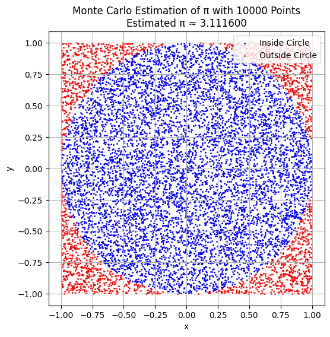

# Problem 2
# 🎲 Estimating π Using Monte Carlo Methods

## 🎯 Motivation

Monte Carlo simulations are powerful computational techniques that use randomness to solve problems or estimate values. One of the most elegant examples is estimating π using **geometric probability**.

By randomly generating points and analyzing whether they fall inside a circle, or simulating physical processes like Buffon's Needle, we can estimate π in intuitive and visually engaging ways.

---

## 🧠 Part 1: Estimating π Using Random Points in a Circle

### 🧪 1. Theoretical Foundation

- Consider a **unit circle** inscribed inside a square of side 2 (centered at the origin).
- The area of the **circle** is:

$$
A_{\text{circle}} = \pi r^2 = \pi \cdot 1^2 = \pi
$$

- The area of the **square** is:

$$
A_{\text{square}} = (2r)^2 = 4
$$

- If we randomly generate \( N \) points inside the square, the fraction that fall inside the circle is approximately:

$$
\frac{\text{Points inside circle}}{N} \approx \frac{A_{\text{circle}}}{A_{\text{square}}} = \frac{\pi}{4}
$$

So we estimate:

$$
\pi \approx 4 \cdot \frac{\text{Points inside circle}}{N}
$$

---

### 🖥️ 2. Python Simulation

```python
import numpy as np
import matplotlib.pyplot as plt

def estimate_pi_circle(num_points=10000, plot=True):
    x = np.random.uniform(-1, 1, num_points)
    y = np.random.uniform(-1, 1, num_points)
    inside = x**2 + y**2 <= 1
    pi_estimate = 4 * np.sum(inside) / num_points

    print(f"Estimated π ≈ {pi_estimate:.6f} using {num_points} random points")

    if plot:
        plt.figure(figsize=(6, 6))
        plt.scatter(x[inside], y[inside], s=1, color="green", label="Inside")
        plt.scatter(x[~inside], y[~inside], s=1, color="red", label="Outside")
        plt.title("Monte Carlo Estimation of π — Circle Method 🎯")
        plt.xlabel("x")
        plt.ylabel("y")
        plt.gca().set_aspect('equal')
        plt.grid(True)
        plt.legend()
        plt.show()

    return pi_estimate
    
```
    



## 📊 3. Visualization (Circle Method)

- ✅ The **green dots** show points inside the circle.
- ❌ The **red dots** are outside.
- 📈 As the number of points increases, the estimate of \( \pi \) converges.

---

## 📈 4. Analysis (Circle Method)

- Larger samples improve accuracy.
- The convergence is **slow**, proportional to:

$$
\frac{1}{\sqrt{N}}
$$

---

## 🪡 Part 2: Estimating \( \pi \) Using Buffon’s Needle

### 🧪 1. Theoretical Foundation

Buffon’s Needle is a classical probability problem.

- Drop a needle of length \( L \) onto a floor with parallel lines spaced \( d \) apart.
- The probability \( P \) of the needle crossing a line is:

$$
P = \frac{2L}{\pi d} \quad \text{(when } L \leq d \text{)}
$$

Solving for \( \pi \):

$$
\pi \approx \frac{2L \cdot N}{d \cdot C}
$$

Where:
- $$N $$: total number of needle drops
- $$ C $$: number of crossings

---

### 🖥️ 2. Python Simulation

```python
def estimate_pi_buffon(num_drops=10000, L=1.0, d=2.0):
    if L > d:
        raise ValueError("Needle length must be ≤ line spacing")

    crossings = 0
    for _ in range(num_drops):
        x_center = np.random.uniform(0, d/2)
        theta = np.random.uniform(0, np.pi/2)
        if x_center <= (L/2) * np.sin(theta):
            crossings += 1

    if crossings == 0:
        print("No crossings. Increase number of drops.")
        return None

    pi_estimate = (2 * L * num_drops) / (d * crossings)
    print(f"Estimated π ≈ {pi_estimate:.6f} using {num_drops} drops")


```


## ✅ Conclusion

🎯 In this project, we explored two classic Monte Carlo methods to estimate the value of $$ \pi $$

1. **🟢 Circle-Based Monte Carlo Method**
2. **🪡 Buffon’s Needle Experiment**

---

### 🔬 Key Takeaways

- **Randomness is Powerful**: Both simulations use randomness to approximate a deterministic constant, showing how probability and geometry intertwine.
- **Circle Method**:
    - Simple and intuitive
    - Faster convergence
    - Ideal for computational applications
- **Buffon’s Needle**:
    - Physically inspired
    - Slower convergence
    - Excellent for teaching experimental probability

---

### 📊 Accuracy & Convergence

- Circle method accuracy improves with sample size following:

$$
\text{Error} \propto \frac{1}{\sqrt{N}}
$$

- Buffon’s method converges more slowly due to physical constraints and geometric dependencies.

---

### 💡 Final Thoughts

- Monte Carlo methods not only estimate constants like $$ \pi \ $$ but also lay the foundation for solving **complex integrals**, **risk analysis**, and **stochastic modeling**.
- These methods emphasize the beauty of **numerical approximation** and the **power of simulations** in modern science and engineering.

---

### 📘 Further Exploration

- 🔢 Extend the simulation to 3D shapes (spheres, cylinders).
- ⏱️ Measure execution time to analyze performance.
- 🧠 Use statistical analy


